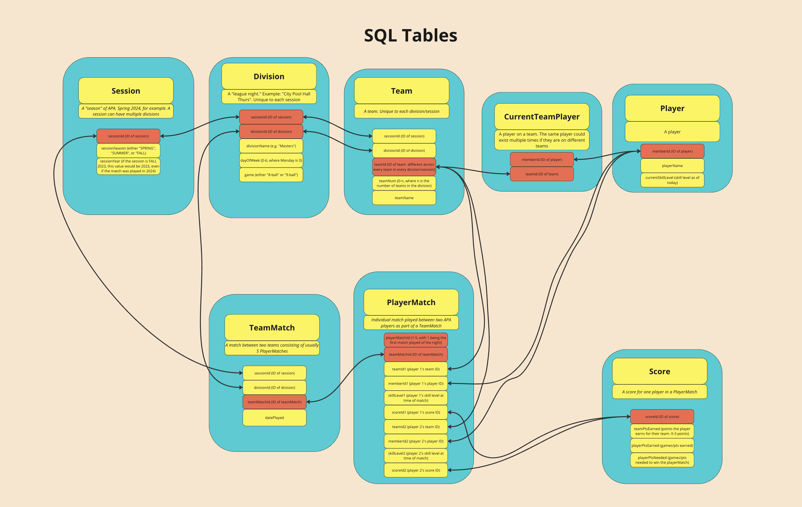

# Getting Results of APA Team
**The purpose of this app is to list the match scores for an APA team so you can see how each player has been performing this season.**

## <u>To run:</u>
### Inserting team and player information
1. Open the application.yml file. This is where you will list the division and player and/or team you want to look up.
2. Insert the link for your division here. You will need to go to the APA website to retrieve this URL
3. Insert the name of the team you want to look up
4. The already existing application.yml file includes examples of what you need to include
5. Add environment variables to include your APA username and password
    - Run `export APA_EMAIL=<email>`
    - Run `export APA_PASSWORD=<password>`
### Setup
1. Create a Python virtual environment by running `python3 -m venv env`
2. Activate the virtual environment by running `source env/bin/activate` 
3. Run `pip3 install -r requirements.txt` to install necessary Python libraries
4. Run `python3 src/main/main.py`. Alternatively, you can run this app with an IDE (like Visual Studio Code) by navigating to the `src/main/main.py` file and running the current file

## <u>Example use cases</u>
Let's say you want to find which opponent your 8 ball team is playing next and print out their team results, meaning who each team member has played throughout the season and how they've done against them. Complete these following steps to do so:

1. Complete the instructions in the "To run" --> "Inserting team and player information" section to insert your team's information. This way, the program can determine who your upcoming opponent is
2. In the `src/main/main.py` file, in the `main` function, add these lines:
    
    ```python
    # scrape the APA website for your season and update the database
    useCase.scrapeUpcomingTeamResults()

    # print your opponent's team results
    useCase.printUpcomingTeamResults()

    # If you wanted to print the json version of the team results to the src/resources/teamResults.json file, add the following line
    useCase.printUpcomingTeamResultsJson()
    ```
3. For other useCases you might want to run, take a look at the src/main/useCase.py


## <u>Data structures</u>
The use case that this app was intended for is to print a player's team results. You can see how the json of this is structured in the `src/resources/teamResults.json` file.
To see how the classes are structured, this diagram is a rough representation of how the various classes are organized:

